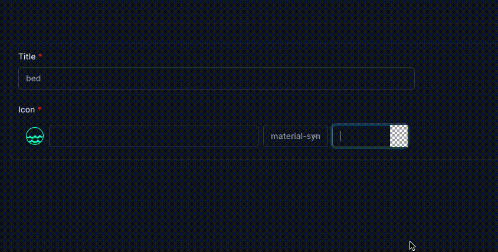

# Django Icon Picker README

## Overview

Django Icon Picker is a custom widget for Django forms that allows users to select icons from a predefined set. It supports both SVG icons and icon IDs, depending on the configuration.

## Features

- **SVG File Support**: If the `DJANGO_ICON_PICKER_PATH` is defined in your Django settings, the Icon Picker will download the selected SVG file and save it to the specified path. The path to the saved SVG file will be stored in the `in=con` field of the form.
- **Icon ID Support**: If the `DJANGO_ICON_PICKER_PATH` is not defined, the Icon Picker will store the ID of the selected icon in the `icon` field.
- **Easy Integration**: Use the `IconPicker` widget as a model field widget in your Django forms.

## Screenshot



## Usage

### Step 1: Install Django Icon Picker

First, ensure you have Django Icon Picker installed in your project. If not, you can install it using pip:

```bash
pip install django-icon-picker
```

Add django_icon_picker to INSTALLED_APPS

```python
# settings.py
INSTALLED_APPS = [
    # Other installed apps,
    'django_icon_picker',
]
```

Update `url.py`, required for download svg file case

```python
urlpatterns = [
    path("admin/", admin.site.urls),
    ## Add icon_pcker urls
    path("", include("django_icon_picker.urls")),
] + static(settings.MEDIA_URL, document_root=settings.MEDIA_ROOT)
```

### Step 2: Configure Django Settings

If you want to use SVG files, define the `DJANGO_ICON_PICKER_PATH` in your Django settings. This is the path where the SVG files will be saved.

```python
# settings.py
DJANGO_ICON_PICKER_PATH = '/path/to/save/svg/files'
```

### Step 3: Use IconPicker in Your Forms

To use the IconPicker widget in your forms, simply specify it as the widget for your icon field.

```python
from django import forms
from django_icon_picker.widgets import IconPicker
from .models import AttributeItem

class AttributeItemForm(forms.ModelForm):
    icon = forms.CharField(widget=IconPicker())

    # is required for download svg file approach
    def __init__(self, *args, **kwargs):
        super().__init__(*args, **kwargs)
        self.fields['icon'].widget.attrs['model'] = self._meta.model.__name__
        if self.instance and self.instance.pk:
            object_id = self.instance.pk
            self.fields['icon'].widget.attrs['objectid'] = object_id
        else:
            last_item_id = AttributeItem.objects.last().id if AttributeItem.objects.exists() else 1
            next_id = last_item_id + 1
            self.fields['icon'].widget.attrs['objectid'] = next_id
```

### Step 4: Override IconPicker Styling

You can override the default styling of the `IconPicker` widget by subclassing it and modifying the `attrs` dictionary in the constructor. Here's an example:

```python
from typing import Any, Dict
from django_icon_picker.widgets import IconPicker

class CustomIconPicker(IconPicker):
    def __init__(self, attrs: Dict[str, Any] | None = None) -> None:
        attrs = attrs or {}
        attrs["class"] = "max-w-2xl"
        attrs["flex_class"] = "px-3 py-2 w-full max-w-2xl"
        attrs["flex_input_class"] = "flex gap-2 items-center"
        attrs["result_class"] = f"absolute flex flex-wrap max-w-md"
        attrs["icons_class"] = "w-12 h-12 py-2 hover:bg-slate-600 rounded-md"
        attrs["selected_icon"] = "w-8 h-8"
        super().__init__(attrs)
```

## Conclusion

Django Icon Picker provides a simple and effective way to include icon selection functionality in your Django forms. Whether you need to work with SVG files or icon IDs, this widget has you covered.
